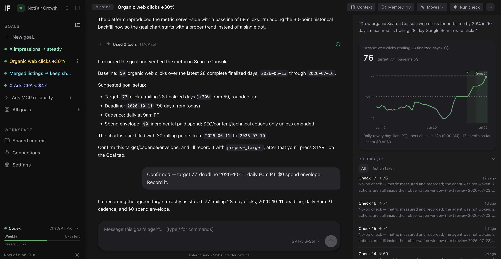

# NotFair

[](https://discord.gg/gVJCRczpps)

**Goal-driven, loop-powered marketing agents that crush your business goals 24/7 — on your own machine.**

Stop babysitting dashboards. State an ambition in plain language:

> *"Grow organic clicks 30% in 90 days."* · *"Cut CAC to $30."* · *"Keep wasted ad spend at $0."*

NotFair gives each ambition a dedicated agent that turns it into a **server-verified metric with a measured baseline**, agrees a target with you in chat, and then runs a disciplined improvement loop against it — measure, score its past moves against what they predicted, make one new move, log the prediction, repeat on your cadence. Around the clock, whether you're watching or not. Goals are the only thing you name, see, and manage; the agents behind them are invisible plumbing.

It runs entirely on your machine, on top of the [Claude Code](https://docs.claude.com/en/docs/agents-and-tools/claude-code/overview) or [Codex](https://github.com/openai/codex) login you already pay for — no new subscription, no hosted runtime, no API keys to manage. Your data lives in a local SQLite file. Open source, MIT.

```bash
npx notfair@latest
```

## See it work



This is a live **"Organic web clicks +30%"** goal — one screen holds the whole loop:

- **The plan is measured before it's agreed** (center): the agent verified the metric in Search Console, the platform reproduced it server-side — baseline **59 clicks** over the latest 28 finalized days — and it backfilled 30 days of history so the chart starts with a trend, not a dot. Then the proposal, in numbers: target `77`, deadline `2026-10-11`, daily 9am checks, `$0` spend envelope. The user replies *"Confirmed — record it."* and the loop is on.
- **The number that matters** (right): clicks at **76** against the target of **77**, with the target line on a time-true chart, the cadence spelled out — next check in 12h, 17 checks so far — and **$0 of $0 spent**.
- **The receipts** (right rail, below the chart): every check is a diary entry. Checks 15–17 are honest no-ops: *"metric measured and recorded; the agent was not woken — 2 actions are still inside their observation window."* The loop doesn't fake activity; it waits for its own experiments to mature. Filter to "Action taken" to see only the checks that changed something.
- **The whole operation** (left): achieve goals ("Organic web clicks +30%", "X Ads CPA < $47") next to maintain watchdogs ("X impressions → steady") that hold a number forever. At the bottom: the harness it's riding — your existing Codex plan, with usage visible.

No approval inbox, no task board, no thread management. You chat with a goal when you have something to say; otherwise the loop runs and the chart tells you how it's going.

## How a goal works

1. **State the ambition.** Type it in your own words and optionally tag a platform focus (SEO, Google Ads, Meta Ads). NotFair provisions an anonymous agent for the goal — agent = goal, 1:1 — and drops you into a chat where it is *already working*.
2. **The agent makes it measurable.** It explores your connected data sources, authors a metric query that returns one number, and tests it. Then the platform **re-runs the exact query server-side** — only a reproducible number with a measured baseline goes on the books. The agent also backfills ~30 days of history so your chart has context from day one.
3. **You confirm the plan — the loop starts on the spot.** The agent reports the baseline and proposes a target, cadence, and spend envelope. The moment you confirm in chat, the goal goes live and the first check runs immediately. Two modes: **achieve** (reach the number, then done) and **maintain** (hold it there forever — a watchdog).
4. **The loop runs on your cadence.** Each check, the platform measures the metric mechanically (the agent never self-reports the number it's judged on) and wakes the agent: it reviews past moves against their predicted effects, records what it learned, and the goal protocol allows at most **one** new move — logged with a falsifiable expected effect and an observation window that gates the touched resources until review.

## What you get

- **One screen per goal.** Chat on the left (where the goal is defined and steered), the loop's state on the right: a time-true progress chart with the target line, every action as a marker on the moment it happened, a tick-by-tick check diary, open actions with review dates, and the agent's accumulated memory.
- **Autonomy with discipline, visibly.** Agents act inside the spend envelope you set, under observation-window rules, with a pause button for scheduled work and every recorded move visible in the app. These are behavioral guardrails for trusted local automation — not an OS-level sandbox.
- **Code changes through pull requests.** Attach a GitHub-backed codebase and the agent works in its own branch, pushes, opens a PR, and registers it with NotFair. The app tracks PR state; merging stays yours.
- **Shared context + private memory.** A workspace-wide `PROJECT.md` brief that every agent carries, plus a per-goal learnings ledger that compounds across checks.
- **One-click platform connections.** The Connections page runs a PKCE OAuth flow — pick the account or property once, and every goal agent in the project is wired automatically. See the full catalog below.

## Where the data comes from

A goal is only as honest as its metric, so NotFair measures at the source. Connect any of these from the Connections page — one-click OAuth, no API keys to copy, no Google Cloud project of your own:

| Data source | What agents get |
|---|---|
| **NotFair Google Ads** | Live campaigns, bids, budgets, keywords, search terms, change history |
| **NotFair Meta Ads** | Facebook + Instagram campaigns, ad sets, creatives, insights |
| **NotFair X Ads** | X (Twitter) campaigns, line items, promoted posts, analytics |
| **NotFair Google Search Console** | Organic queries, pages, impressions, clicks, indexing |
| **NotFair Google Analytics** | GA4 sessions, channels, events, conversions, audiences |
| **PostHog** | Product analytics, funnels, feature flags |
| **Mixpanel** | Event analytics, cohorts, retention |
| **Stripe** | Payments, customers, subscriptions, invoices |
| **Supabase** | Postgres, auth, storage |
| **Any custom MCP** | Paste a URL — anything that speaks MCP over HTTP with OAuth becomes a data source |

The five NotFair-hosted ad and search servers live at [notfair.co](https://notfair.co); PostHog, Mixpanel, Stripe, and Supabase connect through the official MCP endpoints those vendors publish. And when no MCP can measure the ambition, the **`local` source** runs a shell command on your machine and reads the number from stdout — GitHub stars, a row count in a local database, an internal endpoint, anything you can print.

## Install & run

**Prerequisites:** an Apple Silicon Mac, Node 20+, and at least one harness installed and authenticated — [Codex CLI](https://github.com/openai/codex) (recommended) or [Claude Code](https://docs.claude.com/en/docs/agents-and-tools/claude-code/overview). NotFair brings no LLM keys of its own; it runs on the harness login you already pay for.

```bash
npx notfair@latest doctor   # preflight: Node, harnesses, data dir, port
npx notfair@latest          # launch the UI at http://127.0.0.1:3327
```

Or install globally:

```bash
npm install -g notfair
notfair
```

```
notfair                 Launch local server + open UI (default)
notfair start           Same, with --port <n>, --no-open, --data-dir <path>
notfair doctor          Preflight checks with a Fix: line per failure
```

### From source

The app lives in the [`notfair/`](notfair/) directory of this repo. You'll need [pnpm](https://pnpm.io); the native modules (`better-sqlite3`, `keytar`) build automatically on install.

```bash
git clone https://github.com/nowork-studio/NotFair.git
cd NotFair/notfair
pnpm install

pnpm cli doctor   # same preflight the published CLI runs
pnpm dev          # dev server with hot reload at http://127.0.0.1:3326
```

The dev server uses the same `~/.notfair/` data directory as an installed `notfair` — if you run both on one machine, isolate the dev state:

```bash
NOTFAIR_DATA_DIR=$PWD/.notfair-dev pnpm dev
```

For a production-style run from source, `pnpm build` produces the same standalone bundle the npm package ships, and `pnpm cli` runs the CLI (start, doctor) against your checkout. Verify changes with `pnpm typecheck` and `pnpm test`.

Then: create a project, pick your harness, connect the platforms a goal needs, and state your first ambition. Nothing runs — and nothing spends — until you confirm the plan the agent proposes in chat.

## Where your data lives

Everything is local: app state in `~/.notfair/db.sqlite`, agent workspaces in `~/.notfair/agents/<agent-id>/`. OAuth tokens for connected platforms live in that SQLite database (not yet encrypted at the application layer — protect your local user account accordingly).

Full docs, CLI reference, and architecture notes: [`notfair/README.md`](notfair/README.md).

---

## The NotFair plugin — marketing skills for your AI agent

This repo also ships the **NotFair plugin**: SEO, Google Ads, and Meta Ads skills for Claude Code (and any host that reads [`AGENTS.md`](AGENTS.md)). Where the app runs autonomous goal loops, the plugin is the hands-on side — audits, campaign management, copywriting, and SEO work in your terminal, where you drive and the agent executes. Both share the same engine: the ad-platform MCP servers hosted at [notfair.co](https://notfair.co) (Google Ads, Meta Ads, Google Search Console) — sign in once per platform, no API keys to copy.

> *"Am I wasting money on ads right now?"*
> *"Why did my traffic drop and how do I fix it?"*
> *"How do I get more conversions without spending more?"*

It analyzes your traffic, surfaces what's hurting your rankings, finds wasted ad spend, diagnoses creative fatigue and audience saturation, and tells you exactly what to fix. When it has access to your repo, it goes further: rewriting meta tags, fixing headings, adding structured data, and shipping the changes.

### See the skills work

**Google Ads:**

```
You:    /notfair:google-ads-audit

Claude: Connected to your Google Ads account (MyStore).

        3 campaigns active. $2,400 spent this month.

        Scorecard:
        ┌──────────────────────┬──────────┬──────────────────────────────┐
        │ Dimension            │ Status   │ Summary                      │
        ├──────────────────────┼──────────┼──────────────────────────────┤
        │ Conversion tracking  │ OK       │ 3 actions firing correctly   │
        │ Keyword health       │ Critical │ 8 keywords burning cash      │
        │ Search term quality  │ Warning  │ 12 irrelevant queries        │
        │ Impression share     │ Warning  │ Losing 35% to rank           │
        │ Spend efficiency     │ Critical │ $340/mo wasted               │
        └──────────────────────┴──────────┴──────────────────────────────┘

        Top 3 actions:
        1. Pause 3 keywords ($210/mo, zero conversions)
        2. Add 12 negative keywords ($130/mo wasted on irrelevant terms)
        3. Increase bids 15% on 2 high-converting keywords losing IS

        Business context saved — /notfair:google-ads-copy and /notfair:google-ads will use it.

You:    Do it all.

        [paused 3 wasteful keywords — saved $210/mo]
        [added 12 negative keywords — saved $130/mo]
        [increased bids on 2 high-performers]

        Done. All changes are reversible within 7 days.
```

**Weekly review** — ask any time, or set it up as a recurring task:

```
You:    /notfair:google-ads — "review last week's changes"

Claude: 12 changes in the last 7 days. 9 matured enough to judge.

        Wins (4):
        - Paused "cheap seo services" → CTR +18%, conversions +2
        - Added "free" as negative → wasted spend -$84/wk
        - Bid +15% on "b2b crm software" → conversions +3, CPA flat
        - New RSA on "MyStore Brand" ad group → CTR +24%

        Losses (2):
        - Bid +20% on "enterprise saas" → cost +$210, conversions flat
        - Paused "project management tool" → lost 4 conversions/wk

        Too new to judge (3) — check back in 5 days.
```

**SEO:**

```
You:    /notfair:seo-analysis

Claude: Found your site at mystore.com — pulling Search Console data now.

        [90 days of real traffic data loaded]
        [pages crawled for technical issues]

        Three things hurting you most:

        Your homepage lives at two addresses. Google splits your ranking
        power between them. Easy fix.

        Two pages targeting the same search terms — they compete against
        each other and neither wins.

        One page gets 400 monthly impressions but ranks #52. The title
        doesn't match what people actually search for.

        Here's your 30-day plan, most impactful first.
```

### Install the plugin

One-time setup in Claude Code, automatic updates:

```
/plugin marketplace add nowork-studio/notfair
```

```
/plugin install notfair@nowork-studio
```

That's it. All skills are now available as `/notfair:*` commands.

**Google Ads + Meta Ads (optional):** The first time Claude Code connects to either NotFair MCP server (`NotFair-GoogleAds` or `NotFair-MetaAds`), it opens a browser tab and asks you to sign in to [notfair.co](https://notfair.co) — authorize once per platform and the token is stored in your OS keychain. No API key to copy, no `mcp-remote` bridge to install.

<details>
<summary>Prefer to edit settings.json directly?</summary>

Add the marketplace and enable the plugin in `~/.claude/settings.json`:

```json
{
  "extraKnownMarketplaces": {
    "nowork-studio": {
      "source": {
        "source": "github",
        "repo": "nowork-studio/notfair"
      }
    }
  },
  "enabledPlugins": {
    "notfair@nowork-studio": true
  }
}
```

</details>

<details>
<summary>Upgrading from <code>toprank@nowork-studio</code>?</summary>

The plugin was renamed `toprank` → `notfair` in v0.24.0. If you previously installed it as `toprank@nowork-studio`, uninstall the old entry and install the new one:

```
/plugin uninstall toprank@nowork-studio
/plugin marketplace add nowork-studio/notfair
/plugin install notfair@nowork-studio
```

Your data is preserved — the runtime state directory (`~/.toprank/`, holding portfolio state, change logs, business-context cache, audit history) is intentionally retained under its original name for this release. See `CHANGELOG.md` for details.

</details>

### Skills

#### Google Ads

| Skill | What it does |
|-------|-------------|
| [`google-ads-audit`](google-ads/audit/) | Account audit + business context setup. Run this first. Scores 7 health dimensions, identifies wasted spend, builds business profile. |
| [`google-ads`](google-ads/manage/) | Campaign management. Read performance, optimize keywords, adjust bids/budgets, add negatives, create campaigns. Ask for a **weekly review** and Claude scores every recent change (wins, losses, too-new-to-judge). |
| [`google-ads-copy`](google-ads/copy/) | RSA copy generator + A/B testing. Data-driven headlines and descriptions with character counts and pin positions. |
| [`google-ads-landing`](google-ads/landing/) | Landing page audit. Analyzes relevance between keywords, ads, and landing page content to improve Quality Score. |

#### Meta Ads (Facebook + Instagram)

| Skill | What it does |
|-------|-------------|
| [`meta-ads-audit`](meta-ads/audit/) | Account audit + business context setup. Run this first. Scores 7 health dimensions tuned for Meta (Pixel + CAPI Health, Attribution, Campaign Structure, Creative Health, Audience Strategy, Spend Efficiency, Scaling Readiness), persists creative inventory and persona data for downstream skills. |
| [`meta-ads`](meta-ads/manage/) | Campaign management. ROAS analysis, frequency-first triage, creative fatigue diagnosis, Learning Phase / Learning Limited triage, audience overlap, CBO/ABO/Advantage+ Shopping structure. Mutations route through dedicated tools; operations outside that surface route the user to Meta Ads Manager rather than improvising. |

#### SEO

| Skill | What it does |
|-------|-------------|
| [`seo-analysis`](seo/seo-analysis/) | Full SEO audit with GSC data. Quick wins, traffic drops, technical issues, 30-day action plan. |
| [`content-writer`](seo/content-writer/) | SEO content creation following E-E-A-T guidelines. Blog posts, landing pages, content improvements. |
| [`content-planner`](seo/content-planner/) | Builds a dated editorial calendar from real Search Console opportunities, prioritized by click potential and ready to hand to `content-writer`. |
| [`keyword-research`](seo/keyword-research/) | Keyword discovery, intent classification, topic clusters, prioritized content calendar. |
| [`meta-tags-optimizer`](seo/meta-tags-optimizer/) | Title tags, meta descriptions, OG/Twitter cards with A/B variations and CTR estimates. |
| [`schema-markup-generator`](seo/schema-markup-generator/) | JSON-LD structured data for rich results. FAQ, HowTo, Article, Product, LocalBusiness. |
| [`seo-page`](seo/seo-page/) | Single-page deep analysis. Focused audit of a specific URL for content quality, structure, and keyword optimization. |
| [`broken-link-checker`](seo/broken-link-checker/) | Scans websites to find and report broken internal and external links (404s/5xx). |
| [`geo-optimizer`](seo/geo-optimizer/) | Generative Engine Optimization (GEO) for AI search engines. Audits content with a 0–100 GEO Score, rewrites for AI citation, and produces per-engine strategy for ChatGPT, Claude, Perplexity, Gemini, and Google AI Overviews. |
| [`local-seo`](seo/local-seo/) | Local pack / Google Business Profile audit. NAP consistency, GBP completeness, review health, local & service-area pages, and LocalBusiness schema. |
| [`hreflang-international`](seo/hreflang-international/) | International / multilingual SEO. Validates hreflang (return tags, x-default, codes), catches hreflang↔canonical conflicts, and reviews URL-structure strategy. |
| [`sitemap-audit`](seo/sitemap-audit/) | XML sitemap audit. Discovery, structural limits, lastmod accuracy, and a URL reality cross-check (non-200 / noindex / canonicalized-away listed; indexable pages missing). |
| [`image-seo`](seo/image-seo/) | Image SEO audit. Alt text, file names, WebP/AVIF, compression, srcset, CLS width/height, lazy-load, image sitemaps, ImageObject schema. |
| [`ecommerce-seo`](seo/ecommerce-seo/) | E-commerce SEO. Category/product pages, faceted-navigation crawl traps, variant canonicals, out-of-stock handling, Product/Offer schema. |
| [`programmatic-seo`](seo/programmatic-seo/) | Programmatic / templated pages at scale. Demand validation, uniqueness/value gate, internal linking, indexation management, doorway-page guardrails. |
| [`competitor-pages`](seo/competitor-pages/) | Competitor page gap analysis. Coverage matrix, intent/depth/schema comparison vs. top-ranking URLs, and a brief to beat the SERP. |
| [`sxo`](seo/sxo/) | Search Experience Optimization. SERP click factors + post-click experience/conversion (intent match, CWV, CTAs, anti-pogo-stick). |
| [`seo-drift`](seo/seo-drift/) | SEO drift monitoring. Baseline + compare to catch regressions (lost rankings, deindexed pages, overwritten titles, flipped noindex/canonical). |
| [`backlink-audit`](seo/backlink-audit/) | Backlink / off-page audit. Works from the GSC Links report or a paid export; referring domains, anchor text, internal-linking wins, toxic-link verdict. |
| [`setup-cms`](seo/setup-cms/) | Connect WordPress, Strapi, Contentful, or Ghost for automated SEO field audits. |

#### Cross-Model

| Skill | What it does |
|-------|-------------|
| [`gemini`](gemini/) | Second opinion from Google Gemini. Review (pass/fail gate), challenge (adversarial stress test), or consult (open Q&A). Especially strong on Google Ads and SEO decisions — Gemini has native Google ecosystem knowledge. |

#### Maintenance

| Skill | What it does |
|-------|-------------|
| [`upgrade`](notfair-upgrade-skill/) | Updates an installed NotFair plugin to the latest marketplace release and summarizes what changed. |

All skills are namespaced: `/notfair:google-ads`, `/notfair:seo-analysis`, `/notfair:gemini`, etc.

---

## How the repo fits together

NotFair ships as a Claude Code plugin, while the skill directories themselves are host-agnostic and discoverable by compatible coding agents through [`AGENTS.md`](AGENTS.md). Each skill is a `SKILL.md` file with supporting reference documents, scripts, and eval tests. The app lives alongside the skills and is published to npm independently.

```
notfair/
├── .claude-plugin/
│   ├── plugin.json              <- plugin metadata (explicit skill paths)
│   └── marketplace.json         <- registry entry
├── .mcp.json                    <- NotFair MCP servers (Google Ads + Meta Ads + Search Console)
├── notfair/                     <- the goal-loop app (npm: notfair)
├── google-ads/
│   ├── manage/                  <- campaign management (skill: google-ads)
│   ├── audit/                   <- account audit + business context
│   ├── copy/                    <- RSA copy generator + A/B testing
│   └── landing/                 <- landing page scoring + diagnostic
├── meta-ads/
│   ├── manage/                  <- campaign management (skill: meta-ads)
│   ├── audit/                   <- account audit + Meta business context
│   └── shared/                  <- Meta-specific preamble, math, policy registry
├── seo/
│   ├── seo-analysis/            <- full SEO audit with GSC data
│   ├── content-writer/          <- E-E-A-T content creation
│   ├── content-planner/         <- GSC-driven editorial calendar
│   ├── keyword-research/        <- keyword discovery + topic clusters
│   ├── meta-tags-optimizer/     <- title tags, meta descriptions, OG
│   ├── schema-markup-generator/ <- JSON-LD structured data
│   ├── seo-page/                <- single-page deep analysis
│   ├── broken-link-checker/     <- broken link scanner
│   ├── geo-optimizer/           <- GEO for AI search engines
│   ├── local-seo/               <- local pack / Google Business Profile audit
│   ├── hreflang-international/  <- hreflang / multilingual audit
│   ├── sitemap-audit/           <- XML sitemap audit
│   ├── image-seo/               <- image SEO audit
│   ├── ecommerce-seo/           <- e-commerce store SEO audit
│   ├── programmatic-seo/        <- programmatic / templated pages at scale
│   ├── competitor-pages/        <- competitor page gap analysis
│   ├── sxo/                     <- search experience optimization
│   ├── seo-drift/               <- SEO regression monitoring
│   ├── backlink-audit/          <- backlink / off-page audit
│   └── setup-cms/               <- CMS connector
├── gemini/                      <- cross-model review via Gemini CLI
├── notfair-upgrade-skill/       <- self-updater
├── test/                        <- unit + LLM-judge eval tests
└── VERSION
```

---

## MCP Servers

The Google Ads and Meta Ads surfaces are available as standalone remote MCP servers — use either from any MCP client (Claude Desktop, Cursor, Inspector, your own agent) without installing the NotFair CLI plugin.

### NotFair-GoogleAds

- **Registry name:** `io.github.nowork-studio/notfair` (verify: `curl "https://registry.modelcontextprotocol.io/v0.1/servers?search=notfair"`)
- **Endpoint:** `https://notfair.co/api/mcp/google_ads` (streamable HTTP)
- **Auth:** OAuth 2.1 with dynamic client registration — your MCP client opens a browser tab to sign in at [notfair.co](https://notfair.co) on first use; the token is stored locally (OS keychain in Claude Code)

Exposes ~100 Google Ads tools across reads (performance, search terms, impression share, keyword ideas, GAQL), writes (pause/enable, bid and budget updates, keyword and negative list management, campaign creation), and a `runScript` tool that fans out up to 20 GAQL queries in parallel for open-ended analytical questions.

### NotFair-MetaAds

- **Endpoint:** `https://notfair.co/api/mcp/meta_ads` (streamable HTTP)
- **Auth:** Same OAuth 2.1 flow as NotFair-GoogleAds — sign in to [notfair.co](https://notfair.co) once per platform; tokens are independent

Exposes a focused set of Meta Marketing API tools: reads (campaign / ad set / ad listings, `getInsights` with breakdowns), writes (`pauseCampaign`, `pauseAdSet`, `pauseAd`, `enableCampaign`, `enableAdSet`, `enableAd`, `updateCampaignBudget`, `updateAdSetBudget`, `renameCampaign`), `suggestImprovement` for server-side heuristic recommendations, and a `runScript` sandbox with `ads.graph(path, params)`, `ads.graphParallel([calls])` (up to 20 Graph API calls in parallel), `ads.insights(...)`, and `ads.batch([requests])` for analytical fan-out.

The Meta server's mutation surface is intentionally narrow — there is no programmatic create-campaign, no audience editing, and no creative upload. The `/notfair:meta-ads` skill is explicit about this and routes those operations to Meta Ads Manager.

---

## Connectors

NotFair skills reference external tools using the `~~category` placeholder pattern. This makes skills tool-agnostic — they work with any MCP server that provides the required capability.

| Category | Placeholder | Default Server | Alternatives |
|----------|-------------|---------------|--------------|
| Google Ads | `~~google-ads` | [NotFair-GoogleAds MCP](https://notfair.co) (legacy `mcp__notfair__*` still detected during the rename window) | Google Ads MCP (`mcp__google_ads_mcp__*`) |
| Meta Ads | `~~meta-ads` | [NotFair-MetaAds MCP](https://notfair.co) | Any Meta Marketing API MCP (`mcp__.*meta.*ads__*`) |
| Search Console | `~~search-console` | gcloud CLI + Search Console API | Any GSC-compatible MCP server |
| CMS | `~~cms` | Direct API (WordPress REST, Strapi, Contentful, Ghost) | Any CMS MCP server |

Skills use conditional blocks based on available tools. If a connector is not available, the skill gracefully degrades — for example, `seo-analysis` can still run a technical crawl without GSC data.

**Setup:**
- **Google Ads:** See `google-ads/shared/preamble.md`. The `.mcp.json` registers `https://notfair.co/api/mcp/google_ads` as a native HTTP MCP server; on first connection Claude Code opens a browser for OAuth sign-in to [notfair.co](https://notfair.co) and stores the token in your OS keychain — no environment variable, no bridge subprocess.
- **Meta Ads:** See `meta-ads/shared/preamble.md`. The `.mcp.json` registers `https://notfair.co/api/mcp/meta_ads` as a native HTTP MCP server; OAuth sign-in is independent from Google Ads (sign in once per platform). Skills resolve the ad account from a `metaAccountId` field in `.notfair.json` (alongside `accountId` for Google Ads — same config file, no double-prompting).
- **Search Console:** See `seo/shared/preamble.md`. Requires Google Cloud SDK, Search Console API enabled, and OAuth login.
- **CMS:** Run `/notfair:setup-cms` to configure WordPress, Strapi, Contentful, or Ghost.

---

## Contributing

Each skill lives in its own folder under a category directory:

```
seo/                      <- SEO skills go here
└── your-skill-name/
    ├── SKILL.md          <- required
    ├── scripts/          <- optional
    └── references/       <- optional

google-ads/               <- Google Ads skills go here
└── your-skill-name/
    └── SKILL.md          <- required
```

**SKILL.md** needs a frontmatter header with `name` and `description`, then step-by-step instructions in the imperative.

**Scripts:** Python 3.8+ stdlib only (or `requests`). Accept `--output` for file output. stderr for progress, stdout for data.

**Pull requests:** One skill per PR. Test your skill before submitting. Bump `VERSION` and update `CHANGELOG.md`.

For the app, see [`notfair/CONTRIBUTING.md`](notfair/CONTRIBUTING.md) and [`notfair/ARCHITECTURE.md`](notfair/ARCHITECTURE.md).

Questions? Open an issue.

---

## Star History

<a href="https://www.star-history.com/?repos=nowork-studio%2Fnotfair&type=date&legend=top-left">
 <picture>
   <source media="(prefers-color-scheme: dark)" srcset="https://api.star-history.com/chart?repos=nowork-studio/notfair&type=date&theme=dark&legend=top-left" />
   <source media="(prefers-color-scheme: light)" srcset="https://api.star-history.com/chart?repos=nowork-studio/notfair&type=date&legend=top-left" />
   
 </picture>
</a>

---

## License

[MIT](LICENSE)
