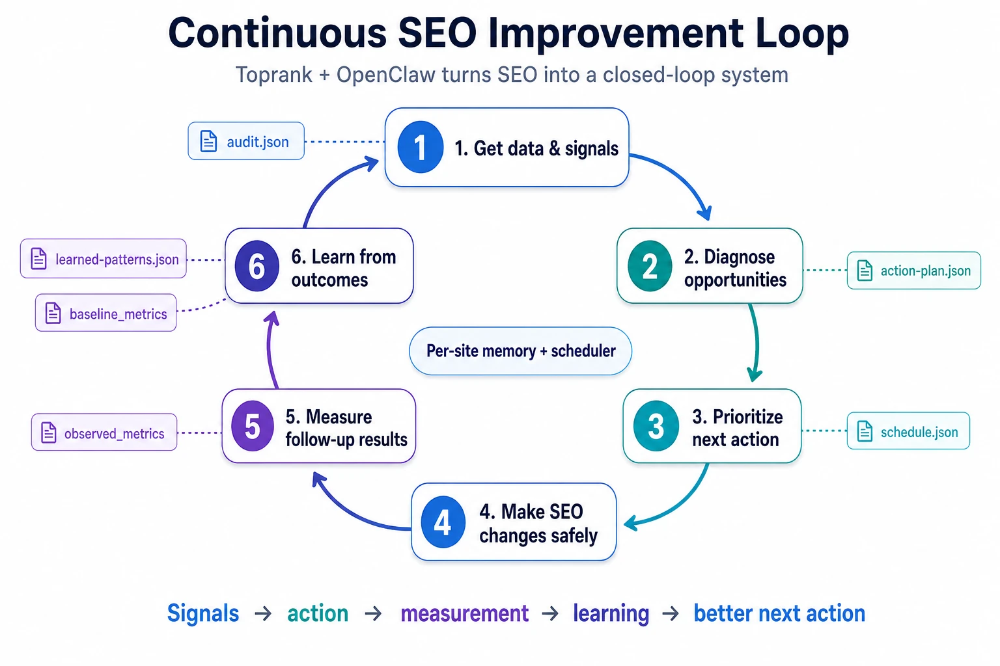

# OpenClaw surface for Toprank

Toprank + OpenClaw is now a **closed-loop SEO operator**.

It does not just run one-off audits. It can now:
- pull real SEO signals from Google Search Console,
- diagnose opportunities,
- prioritize the next action using learned history,
- persist proposals and safe operational steps,
- schedule follow-up checks,
- score whether changes worked,
- update learned priors,
- and keep going.

This directory adds that multi-site adaptive layer for OpenClaw **without replacing the existing Toprank skills**.

## The new power

**SEO becomes a continuous system instead of a manual project.**

```text
signals -> diagnosis -> action -> follow-up measurement -> scoring -> learned priors -> better next action
```



In practice, this means OpenClaw can continuously work a portfolio of sites by reading live data, generating the next best move, revisiting outcomes later, and getting smarter from the result.

## What it is

- `skills/` — OpenClaw wrapper skills
- `shared/` — adapter rules, artifact contract, policy, and trigger docs
- `artifacts/schemas/` — JSON schemas for runtime artifacts
- `bin/` — small helper scripts for multi-site workspace bootstrapping
- `install/` — installers/bootstrap helpers

## What it is not

- not a second copy of the SEO skill library
- not a replacement for the Claude plugin surface
- not a production auto-publisher

## Runtime state

The adaptive layer writes runtime state outside the repo by default:

```
~/.toprank/openclaw
```

Override with:

```
export TOPRANK_OPENCLAW_HOME=/custom/path
```

## Install

The wrappers are designed to be **symlinked** into `~/.openclaw/skills/` so they can still resolve the canonical `seo/` skills in this repo.

```bash
./openclaw/install/install.sh
```

That script:

1. creates `~/.toprank/openclaw/` if needed,
2. bootstraps `portfolio.json` and `schedule.json`,
3. symlinks all `openclaw/skills/*` into `~/.openclaw/skills/`.

## Bootstrap a site work folder

```bash
./openclaw/install/bootstrap-site.sh https://example.com
```

That creates:

```text
~/.toprank/openclaw/sites/example.com/
├── site-profile.json
├── goals.json
├── latest-state.json
├── learned-patterns.json
├── queue/
├── proposals/
├── runs/
└── feedback/
```

## Why this matters

Before this layer, Toprank had strong point skills.

Now it has memory and recurrence:
- **real signal ingestion** via GSC analysis,
- **persistent state** per website,
- **scheduled follow-ups** instead of forgotten recommendations,
- **feedback scoring** instead of vague “seems better”,
- **learned priors** so future prioritization adapts.

That is the step from “SEO assistant” to “SEO operating loop”.

## Working helper scripts

- `python3 openclaw/bin/onboard_site.py <url> ...` — updates `portfolio.json`, `site-profile.json`, and `goals.json`
- `python3 openclaw/bin/persist_run.py <site> --payload-file payload.json` — writes review artifacts into a timestamped run folder and refreshes `latest-state.json`
- `python3 openclaw/bin/portfolio_review.py` — ranks active sites and writes a portfolio review snapshot
- `python3 openclaw/bin/weekly_review.py <site>` — generates a real weekly review payload from GSC analysis, persists artifacts, and creates a scored follow-up baseline
- `python3 openclaw/bin/improve_page.py <site> --url <url> ...` — persists a page-improvement proposal and follow-up task
- `python3 openclaw/bin/investigate_drop.py <site> --summary "..." ...` — persists a drop investigation and recovery plan
- `python3 openclaw/bin/followups_due.py` — shows which scheduled follow-up items are due now
- `python3 openclaw/bin/run_scheduler.py` — processes due schedule items, materializes follow-up review artifacts, and surfaces manual-attention work
- `python3 openclaw/bin/record_followup_metrics.py <site> <item_id> ...` — records observed metrics on a queued follow-up
- `python3 openclaw/bin/hydrate_followup_gsc.py <site> <item_id> ...` — pulls real GSC metrics into a queued follow-up using the existing `seo-analysis` scripts (uses `site-profile.json` `gsc_property` when present, otherwise falls back to `canonical_url`)
- `python3 openclaw/bin/score_feedback.py --item-file <queue-item.json>` — scores a follow-up as win / neutral / loss / inconclusive

Use these example payloads and flows as templates:

- `openclaw/artifacts/examples/weekly-review-payload.json`
- `openclaw/artifacts/examples/gsc-analysis-sample.json`
- `openclaw/artifacts/examples/improve-page-payload.json`
- `openclaw/artifacts/examples/investigate-drop-payload.json`
- `openclaw/artifacts/examples/scored-feedback-item.json`

## Wrapper skills

- `toprank-site-onboard` — register a site and initialize its work folder
- `toprank-portfolio-review` — rank all active sites by urgency/opportunity
- `toprank-weekly-review` — review one site and propose the next best action
- `toprank-improve-page` — improve one URL on a site
- `toprank-investigate-drop` — traffic-drop recovery workflow

## Autonomous loop building blocks

The closed loop is now made of three concrete runtime pieces:

1. **Weekly review from real data**
   - `weekly_review.py` runs or reads GSC analysis
   - generates `audit.json`, `action-plan.json`, `verification.json`
   - seeds `baseline_metrics` for later scoring

2. **Scheduled follow-up evaluation**
   - `run_scheduler.py` revisits due `feedback_check` items
   - `hydrate_followup_gsc.py` can pull fresh observed metrics
   - `score_feedback.py` classifies `win` / `neutral` / `loss` / `inconclusive`

3. **Learning from outcomes**
   - `learned-patterns.json` stores site-level priors
   - weekly review uses those priors to bias future action ranking

## Automated weekly review

The OpenClaw layer now has a real weekly review runner:

```bash
python3 openclaw/bin/weekly_review.py example.com
```

Useful flags:
- `--gsc-property sc-domain:example.com`
- `--analysis-file openclaw/artifacts/examples/gsc-analysis-sample.json`

This runner:
- runs or reads GSC analysis,
- builds `audit.json`, `action-plan.json`, and `verification.json`,
- inherits baseline metrics into the follow-up queue item,
- uses `learned-patterns.json` to bias action ranking,
- turns raw signals into a concrete next action plus a measurable follow-up.

## Scheduler runner

The MVP now includes a simple runner for automation:

```bash
python3 openclaw/bin/run_scheduler.py
# or
./openclaw/install/run-scheduler.sh
```

What it does today:
- processes due `feedback_check` items automatically,
- scores them as `win`, `neutral`, `loss`, or `inconclusive` when metric snapshots exist,
- writes follow-up run artifacts,
- marks processed schedule items,
- updates `learned-patterns.json` with outcome priors,
- surfaces unsupported due items as `ready_for_attention`.

Install it on macOS with launchd:

```bash
./openclaw/install/install-launchd.sh --write-only
# inspect the plist, then load it for real:
./openclaw/install/install-launchd.sh
```

Or use the cron example at `openclaw/install/toprank-openclaw.cron.example`.

This is now the core of a real autonomous operator loop.

## Design principle

The OpenClaw surface is an **adapter layer**. The existing Toprank skill folders remain canonical. The OpenClaw wrappers add persistent state, portfolio awareness, artifact writing, and policy gates.
